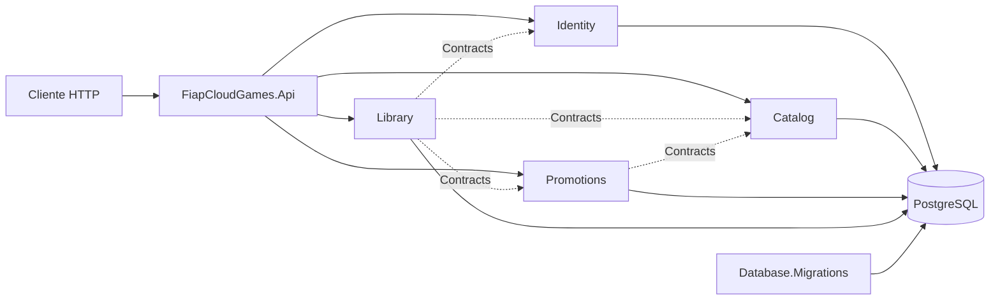

# FIAP Cloud Games

API HTTP para cadastro e autenticação de usuários, administração de um catálogo de jogos, criação de promoções e manutenção da biblioteca adquirida por cada usuário.

O sistema resolve o núcleo de uma loja de jogos digitais para dois públicos:

- usuários, que consultam o catálogo, autenticam-se e adicionam jogos à própria biblioteca;
- administradores, que gerenciam usuários, jogos e promoções.

Estado atual comprovado pelo repositório: implementação de referência em monólito modular, com API, persistência PostgreSQL, migrations, Docker e testes automatizados. Não há versão publicada, pipeline de CI/CD ou ambiente de produção identificado.

## Funcionalidades

- cadastro, login, consulta e desativação de usuários;
- autenticação JWT e autorização pelas roles `User` e `Administrator`;
- cadastro, consulta, atualização, ativação e inativação de jogos;
- criação, consulta e encerramento de promoções;
- seleção do maior desconto vigente para um jogo;
- aquisição sem duplicidade e consulta da biblioteca do usuário;
- criação idempotente do primeiro administrador pelo migrador;
- health check de processo e especificação OpenAPI em desenvolvimento.

Não existe processamento de pagamento, carrinho, refresh token, mensageria ou frontend neste repositório.

## Tecnologias confirmadas

| Tecnologia | Versão | Finalidade | Evidência |
|---|---:|---|---|
| .NET SDK | 10.0.302 | Compilação da solution | `global.json` |
| .NET / ASP.NET Core | `net10.0` / 10.0.10 | API com Controllers, autenticação e OpenAPI | `Directory.Build.props`, `Directory.Packages.props` |
| Entity Framework Core | 10.0.10 | Mapeamento e acesso a dados por módulo | projetos `Infrastructure` |
| Npgsql EF Core | 10.0.3 | Provider PostgreSQL | projetos `Infrastructure` |
| PostgreSQL | imagem 17-alpine | Banco relacional | `docker-compose.yml` |
| EF Core Migrations | 10.0.10 | Criação e evolução centralizada do banco | projeto `Database.Migrations` |
| JWT Bearer | 10.0.10 | Autenticação e validação de token | módulo Identity |
| Microsoft OpenAPI | 2.11.0 | Geração da especificação | API |
| xUnit | 2.9.3 | Testes automatizados | projetos em `tests` |
| NetArchTest | 1.3.2 | Regras de dependência | `ArchitectureTests` |
| Docker Compose | versão não fixada | Orquestra PostgreSQL, migrador e API | `docker-compose.yml` |

As versões de todos os pacotes estão centralizadas em `Directory.Packages.props`.

## Arquitetura em um minuto

A aplicação é um **monólito modular**: somente `FiapCloudGames.Api` hospeda HTTP, mas Identity, Catalog, Promotions e Library possuem projetos e schemas de banco próprios.



Cada módulo possui `Domain`, `Contracts`, `Application`, `Infrastructure` e
`Presentation`. Chamadas entre módulos usam apenas interfaces e DTOs de
`Contracts`. `Domain.Common` contém a exceção transversal de violação de
invariante; `Application.Common` concentra unidade de trabalho e erros
semânticos da aplicação. Application e Presentation organizam cada feature em
arquivos separados para services, inputs/results, requests/responses e
mapeamentos. Não há eventos de integração, dispatcher, broker, publicação ou
consumo implementado.

Detalhes: [visão arquitetural](docs/architecture/overview.md),
[modelo de domínio](docs/architecture/domain-model.md),
[objetos e contratos por fronteira](docs/architecture/data-contracts.md),
[módulos](docs/architecture/modules.md),
[camadas](docs/architecture/layers.md) e
[fluxo de requisição](docs/architecture/request-flow.md).

## Início rápido com Docker

### 1. Obter o código

```text
TODO: URL de clone do repositório não identificada no repositório.
```

Depois do clone, entre na pasta que contém `FiapCloudGames.sln`.

### 2. Verificar pré-requisitos

```powershell
dotnet --version
docker version
docker compose version
```

O `dotnet --version` deve resolver o SDK 10.0.302 ou patch compatível, conforme `global.json`.

### 3. Criar o arquivo local de ambiente

Copie `.env.example` para `.env` e substitua todos os valores de exemplo:

```powershell
Copy-Item .env.example .env
```

O `.env` é ignorado pelo Git. `JWT_KEY` precisa ter ao menos 32 caracteres;
`ADMIN_PASSWORD` precisa ter ao menos 8 caracteres, com letras, números e
caracteres especiais.

### 4. Compilar e testar

```powershell
dotnet restore FiapCloudGames.sln
dotnet build FiapCloudGames.sln --no-restore
dotnet test FiapCloudGames.sln --no-build --no-restore
```

### 5. Subir a aplicação

```powershell
docker compose up --build -d
docker compose ps
docker compose logs migrator
docker compose logs api
```

Resultado esperado:

- PostgreSQL em `localhost:5432`;
- API em `http://localhost:8080`;
- `GET http://localhost:8080/health` responde `Healthy`;
- o migrador termina com código zero antes de a API iniciar.

No Compose, `ASPNETCORE_ENVIRONMENT=Production`; por isso o JSON do Swagger e a
interface Swagger UI **não** são expostos nessa execução.

## Execução local da API e OpenAPI

Suba somente o banco:

```powershell
$env:POSTGRES_PASSWORD = "change-me"
docker compose up database -d
```

Defina configurações apenas na sessão atual:

```powershell
$env:ConnectionStrings__Database = "Host=localhost;Port=5432;Database=fiap_cloud_games;Username=fiap_cloud_games;Password=change-me"
$env:Jwt__Key = "change-me-with-at-least-32-characters"
$env:Admin__Name = "Administrador local"
$env:Admin__Email = "admin@example.com"
$env:Admin__Password = "change-me-now-1!"
```

Aplique o schema e crie o administrador:

```powershell
dotnet run --project src/Database/FiapCloudGames.Database.Migrations
```

Inicie a API:

```powershell
dotnet run --project src/Api/FiapCloudGames.Api --launch-profile https
```

URLs do perfil `https`:

- API HTTPS: `https://localhost:7080`;
- API HTTP: `http://localhost:5080`;
- OpenAPI em Development: `https://localhost:7080/swagger/v1/swagger.json`;
- Swagger UI em Development: `https://localhost:7080/swagger/index.html`;
- health check: `https://localhost:7080/health`.

Em `Development`, o host expõe a especificação OpenAPI e o Swagger UI.

## Autenticar

```http
POST /api/auth/login
Content-Type: application/json

{
  "email": "admin@example.com",
  "password": "change-me-now-1!"
}
```

Use o campo `accessToken` retornado:

```http
Authorization: Bearer {accessToken}
```

O token expira duas horas após a emissão. Não há refresh token.

## Documentação

O [índice central](docs/README.md) organiza os guias por perfil. Atalhos:

- [primeiros passos](docs/onboarding/getting-started.md);
- [ambiente local](docs/onboarding/local-environment.md);
- [inventário do repositório](docs/repository-inventory.md);
- [arquitetura](docs/architecture/overview.md);
- [módulos](docs/architecture/modules.md);
- [criar um endpoint](docs/development/creating-an-endpoint.md);
- [configuração](docs/development/configuration.md);
- [persistência e migrations](docs/development/database-migrations.md);
- [autenticação e autorização](docs/development/authentication-authorization.md);
- [testes](docs/testing/overview.md);
- [referência de endpoints](docs/api/endpoints.md);
- [Docker](docs/operations/docker.md);
- [deploy](docs/operations/deployment.md);
- [troubleshooting](docs/operations/troubleshooting.md);
- [como contribuir](CONTRIBUTING.md);
- [decisões arquiteturais](docs/adr/README.md).

## Estrutura resumida

```text
FiapCloudGames.sln
src/
├── Api/FiapCloudGames.Api
├── BuildingBlocks/
│   ├── FiapCloudGames.Domain.Common
│   └── FiapCloudGames.Application.Common
├── Database/FiapCloudGames.Database.Migrations
└── Modules/
    ├── Identity
    ├── Catalog
    ├── Library
    └── Promotions
tests/
├── Unit
├── Integration
└── Architecture
docs/
├── onboarding
├── architecture
├── development
├── testing
├── operations
├── api
└── adr
```

## Limites operacionais atuais

- o health check não verifica PostgreSQL;
- os testes de integração não sobem um PostgreSQL real;
- o executável do migrador aplica apenas migrations pendentes; rollback é feito
  explicitamente com `dotnet ef database update` por contexto;
- não há CI/CD, registro de imagens ou alvo de deploy;
- logs usam os providers padrão do ASP.NET Core; não há métricas, tracing ou APM;
- não há versionamento, paginação, filtro público ou ordenação configurável na API;
- não há transação distribuída, outbox ou comunicação assíncrona.

Esses itens são explicados nos guias de [operações](docs/operations/README.md) e [riscos arquiteturais](docs/architecture/decisions.md).
