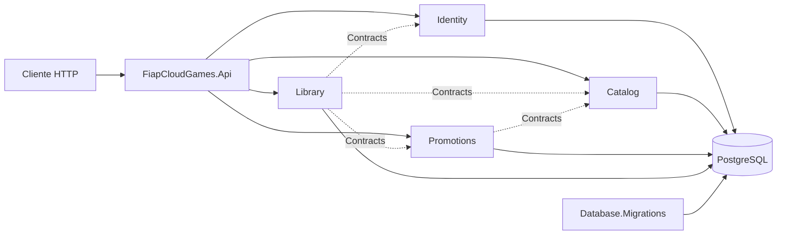

# FIAP Cloud Games


API REST para cadastro e autenticação de usuários, administração de catálogo de jogos, criação de promoções e gestão da biblioteca pessoal de cada usuário.

Projeto desenvolvido como trabalho acadêmico da **FIAP**, implementado como monólito modular com API em ASP.NET Core, persistência PostgreSQL e testes automatizados.

---

## Objetivos

O sistema resolve o núcleo de uma loja de jogos digitais para dois públicos:

- **Usuários** — consultam o catálogo, autenticam-se e adicionam jogos à própria biblioteca;
- **Administradores** — gerenciam usuários, jogos e promoções.

O que **não** está no escopo: processamento de pagamento, carrinho, refresh token, mensageria ou frontend.

---

## Funcionalidades

| Módulo | Funcionalidade |
|---|---|
| **Identity** | Cadastro, login, consulta e desativação de usuários |
| **Identity** | Autenticação JWT com roles `User` e `Administrator` |
| **Catalog** | Cadastro, consulta, atualização, ativação e inativação de jogos |
| **Promotions** | Criação, consulta e encerramento de promoções com desconto automático |
| **Library** | Aquisição sem duplicidade e consulta da biblioteca do usuário |
| **Sistema** | Health check de processo e especificação OpenAPI em ambiente de desenvolvimento |

---

## Tecnologias

| Tecnologia | Versão | Finalidade |
|---|---:|---|
| .NET SDK | 10.0.302 | Compilação da solution |
| ASP.NET Core | net10.0 / 10.0.10 | API com Controllers, autenticação e OpenAPI |
| Entity Framework Core | 10.0.10 | Mapeamento e acesso a dados por módulo |
| Npgsql EF Core | 10.0.3 | Provider PostgreSQL |
| PostgreSQL | 17-alpine | Banco relacional |
| JWT Bearer | 10.0.10 | Autenticação e validação de token |
| Microsoft OpenAPI | 2.11.0 | Geração da especificação OpenAPI |
| xUnit | 2.9.3 | Testes automatizados |
| NetArchTest | 1.3.2 | Testes de regras de dependência |
| Docker Compose | — | Orquestra PostgreSQL, migrador e API |

> Todas as versões de pacotes estão centralizadas em `Directory.Packages.props`.

---

## Arquitetura

A aplicação é um **monólito modular**: somente `FiapCloudGames.Api` hospeda HTTP, mas os módulos Identity, Catalog, Promotions e Library possuem projetos, schemas de banco e fronteiras públicas próprios.



Cada módulo possui cinco camadas: `Domain`, `Contracts`, `Application`, `Infrastructure` e `Presentation`. Comunicação entre módulos ocorre exclusivamente via interfaces e DTOs de `Contracts`.

Detalhes: [visão arquitetural](docs/architecture/overview.md) · [modelo de domínio](docs/architecture/domain-model.md) · [módulos](docs/architecture/modules.md) · [camadas](docs/architecture/layers.md) · [fluxo de requisição](docs/architecture/request-flow.md)

---

## Estrutura do Repositório

```text
FiapCloudGames.sln
src/
├── Api/FiapCloudGames.Api
├── BuildingBlocks/
│   ├── FiapCloudGames.Domain.Common
│   └── FiapCloudGames.Application.Common
├── Database/FiapCloudGames.Database.Migrations
└── Modules/
    ├── Identity
    ├── Catalog
    ├── Library
    └── Promotions
tests/
├── Unit
├── Integration
└── Architecture
docs/
├── onboarding
├── architecture
├── development
├── testing
├── operations
├── api
└── adr
```

---

## Início Rápido com Docker

### 1. Clonar o repositório

```bash
git clone https://github.com/MarinsPedro/Fiap.git
cd Fiap
```

### 2. Verificar pré-requisitos

```powershell
dotnet --version   # deve resolver SDK 10.0.302 ou patch compatível
docker version
docker compose version
```

### 3. Criar o arquivo de ambiente

```powershell
Copy-Item .env.example .env
```

Edite o `.env` substituindo todos os valores de exemplo. O arquivo é ignorado pelo Git.

```env
POSTGRES_PASSWORD=troque-esta-senha
JWT_KEY=troque-por-uma-chave-com-ao-menos-32-caracteres
ADMIN_NAME=Administrador FIAP
ADMIN_EMAIL=admin@exemplo.com
ADMIN_PASSWORD=troque-esta-senha-tambem
```

> `JWT_KEY` precisa ter ao menos 32 caracteres; `ADMIN_PASSWORD` ao menos 8.

### 4. Compilar e testar

```powershell
dotnet restore FiapCloudGames.sln
dotnet build FiapCloudGames.sln --no-restore
dotnet test FiapCloudGames.sln --no-build --no-restore
```

### 5. Subir a aplicação

```powershell
docker compose up --build -d
docker compose ps
docker compose logs migrator
docker compose logs api
```

Resultado esperado após a inicialização:

| Serviço | Endereço |
|---|---|
| PostgreSQL | `localhost:5432` |
| API | `http://localhost:8080` |
| Health check | `GET http://localhost:8080/health` → `Healthy` |

> Em produção (Compose), o Swagger UI **não** é exposto. Use o perfil local para acessá-lo.

---

## Execução Local com Swagger UI

Suba apenas o banco de dados:

```powershell
$env:POSTGRES_PASSWORD = "change-me"
docker compose up database -d
```

Configure as variáveis de ambiente na sessão atual:

```powershell
$env:ConnectionStrings__Database = "Host=localhost;Port=5432;Database=fiap_cloud_games;Username=fiap_cloud_games;Password=change-me"
$env:Jwt__Key = "change-me-with-at-least-32-characters"
$env:Admin__Name = "Administrador local"
$env:Admin__Email = "admin@example.com"
$env:Admin__Password = "change-me-now"
```

Aplique as migrations e crie o administrador inicial:

```powershell
dotnet run --project src/Database/FiapCloudGames.Database.Migrations
```

Inicie a API:

```powershell
dotnet run --project src/Api/FiapCloudGames.Api --launch-profile https
```

URLs disponíveis em `Development`:

| Recurso | URL |
|---|---|
| API (HTTPS) | `https://localhost:7080` |
| API (HTTP) | `http://localhost:5080` |
| Swagger UI | `https://localhost:7080/swagger/index.html` |
| OpenAPI JSON | `https://localhost:7080/swagger/v1/swagger.json` |
| Health check | `https://localhost:7080/health` |

---

## Autenticação

### 1. Fazer login

```http
POST /api/auth/login
Content-Type: application/json

{
  "email": "admin@example.com",
  "password": "change-me-now"
}
```

Resposta:

```json
{
  "accessToken": "<jwt>",
  "expiresAtUtc": "2026-01-01T02:00:00Z",
  "user": { "id": "...", "name": "...", "email": "...", "role": "Administrator" }
}
```

### 2. Usar o token

Inclua o header em todas as requisições autenticadas:

```http
Authorization: Bearer {accessToken}
```

> O token expira **2 horas** após a emissão. Não há refresh token.

---

## Referência de Endpoints

| Método | Rota | Acesso | Status de sucesso |
|---|---|---|---:|
| `GET` | `/health` | público | 200 |
| `POST` | `/api/users` | público | 201 |
| `POST` | `/api/auth/login` | público | 200 |
| `GET` | `/api/users/me` | autenticado | 200 |
| `GET` | `/api/users/{id}` | Administrator | 200 |
| `DELETE` | `/api/users/{id}` | Administrator | 204 |
| `GET` | `/api/games` | público | 200 |
| `GET` | `/api/games/{id}` | público | 200 |
| `POST` | `/api/games` | Administrator | 201 |
| `PUT` | `/api/games/{id}` | Administrator | 200 |
| `GET` | `/api/promotions/active` | público | 200 |
| `POST` | `/api/promotions` | Administrator | 201 |
| `POST` | `/api/promotions/{id}/end` | Administrator | 204 |
| `GET` | `/api/library` | autenticado | 200 |
| `POST` | `/api/library/games/{gameId}` | autenticado | 201 |

Exemplos completos de request/response: [referência de endpoints](docs/api/endpoints.md)

---

## Documentação

O [índice central](docs/README.md) organiza os guias por perfil. Atalhos rápidos:

**Onboarding**
- [Primeiros passos](docs/onboarding/getting-started.md)
- [Ambiente local](docs/onboarding/local-environment.md)
- [Inventário do repositório](docs/repository-inventory.md)

**Desenvolvimento**
- [Criar um endpoint](docs/development/creating-an-endpoint.md)
- [Autenticação e autorização](docs/development/authentication-authorization.md)
- [Persistência e migrations](docs/development/database-migrations.md)
- [Configuração](docs/development/configuration.md)

**Testes**
- [Visão geral de testes](docs/testing/overview.md)

**Operações**
- [Docker](docs/operations/docker.md)
- [Deploy](docs/operations/deployment.md)
- [Troubleshooting](docs/operations/troubleshooting.md)

**Referência**
- [Endpoints da API](docs/api/endpoints.md)
- [Decisões arquiteturais (ADRs)](docs/adr/README.md)
- [Como contribuir](CONTRIBUTING.md)

---

## Limites Atuais

- o health check não verifica conectividade com o PostgreSQL;
- os testes de integração não sobem um PostgreSQL real;
- não há CI/CD, registro de imagens ou ambiente de produção identificado;
- rollback de migration é feito manualmente com `dotnet ef database update` por contexto;
- logs usam os providers padrão do ASP.NET Core; não há métricas, tracing ou APM;
- não há versionamento, paginação ou filtros avançados na API;
- não há transação distribuída, outbox ou comunicação assíncrona.

