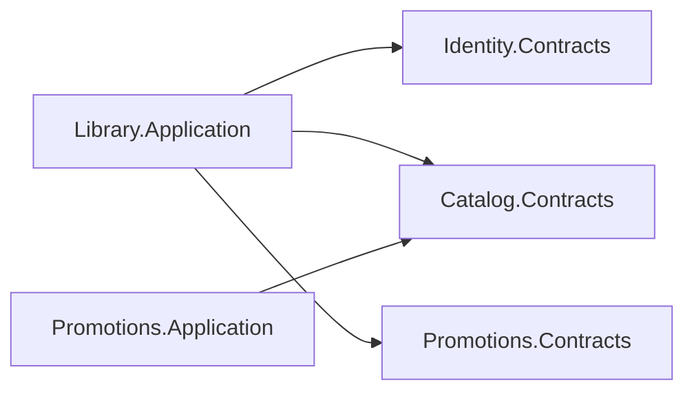

# Dependências

## Direção por camada

```mermaid
flowchart TD
    Domain --> DomainCommon[\"Domain.Common\"]
    Application --> ApplicationCommon[\"Application.Common\"]
    Presentation --> Application
    Application --> Domain
    Application --> Contracts
    Infrastructure --> Application
    Infrastructure --> Domain
    Api --> Presentation
    Api --> Infrastructure
```

## Dependências entre módulos



Não existem outras referências entre módulos nos `.csproj`.

| Consumidor | Domain próprio | Contracts próprio | Identity.Contracts | Catalog.Contracts | Promotions.Contracts |
|---|---:|---:|---:|---:|---:|
| Identity.Application | sim | sim | — | não | não |
| Catalog.Application | sim | sim | não | — | não |
| Promotions.Application | sim | sim | não | sim | — |
| Library.Application | sim | sim | sim | sim | sim |

## Composition root

`FiapCloudGames.Api.csproj` referencia os quatro Presentation e os quatro Infrastructure. Não referencia Domain, Application ou Contracts diretamente.

## Migrations

`FiapCloudGames.Database.Migrations` referencia os projetos Infrastructure de
Identity, Catalog, Promotions e Library para reutilizar os quatro `DbContext`.
Ele não referencia Presentation. O teste
`MigrationsShouldNotReferenceModulePresentation` protege essa fronteira.

## Regras automatizadas e lacunas

Testes atuais verificam:

- Domain sem ASP.NET Core, EF Core ou Infrastructure;
- Library.Application sem Application/Infrastructure de outros módulos;
- migrador sem dependência de Presentation dos módulos.

Não há teste específico para todas as combinações, como Presentation → Infrastructure ou Application → Infrastructure em cada módulo.

Recomendação: ampliar `ArchitectureRulesTests` quando novas camadas ou módulos forem adicionados.
