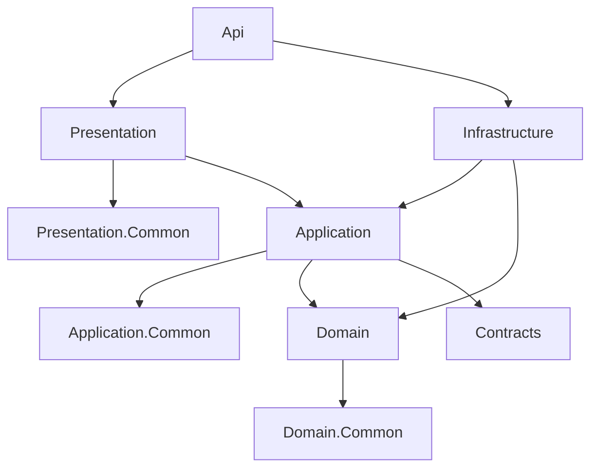
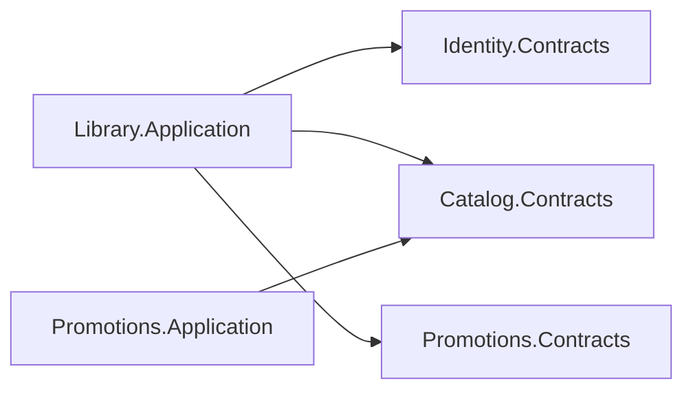

# Dependências

## Regra de direção



Uma seta indica dependência permitida, não obrigatória.

## Entre módulos

O consumidor conhece apenas Contracts do módulo fornecedor:



As regras são:

- Domain não referencia outro módulo;
- Application não referencia Application ou Infrastructure externos;
- Presentation não é uma API interna entre módulos;
- entidades e `DbContext` nunca atravessam a fronteira;
- Queries e Snapshots de Contracts formam o contrato síncrono.

A matriz efetiva deve ser consultada nos `ProjectReference` dos `*.csproj`.
Não mantenha uma segunda lista manual de todas as referências.

## Composition root e migrations

A API pode referenciar Presentation e Infrastructure para compor o processo. Isso
não autoriza a colocação de regra de negócio no host.

O migrador pode referenciar Infrastructure para reutilizar mappings e
`DbContext`, mas não depende de Presentation.

## Proteção executável

ArchitectureTests fiscaliza as direções de projeto, isolamento entre módulos,
tipos expostos e convenções estruturais. A lista e o resultado atuais pertencem
ao código e a:

```powershell
dotnet test tests/Architecture/FiapCloudGames.ArchitectureTests
```

Ao alterar uma fronteira, atualize primeiro a regra arquitetural e seu teste; não
adapte o teste apenas para aceitar uma dependência acidental.
