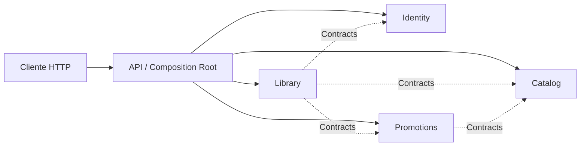
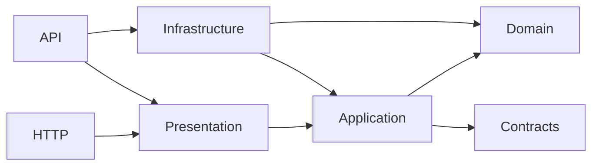
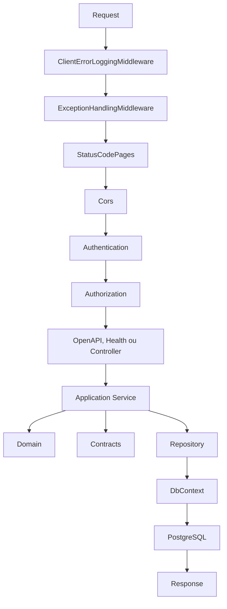
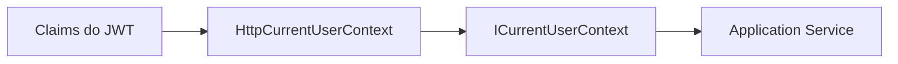
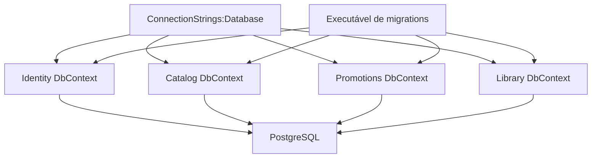

# Diagramas

Os diagramas representam regras de direção e fluxo, não inventários completos de
classes ou operações.

## Módulos e host

## Camadas

As setas representam dependências permitidas. Contracts externos são a única
entrada entre módulos.

## Pipeline HTTP

O fluxo autoritativo e suas responsabilidades estão em
[request-flow.md](request-flow.md).

## Identidade atual

Application conhece a porta, mas não conhece `HttpContext`.

## Persistência

