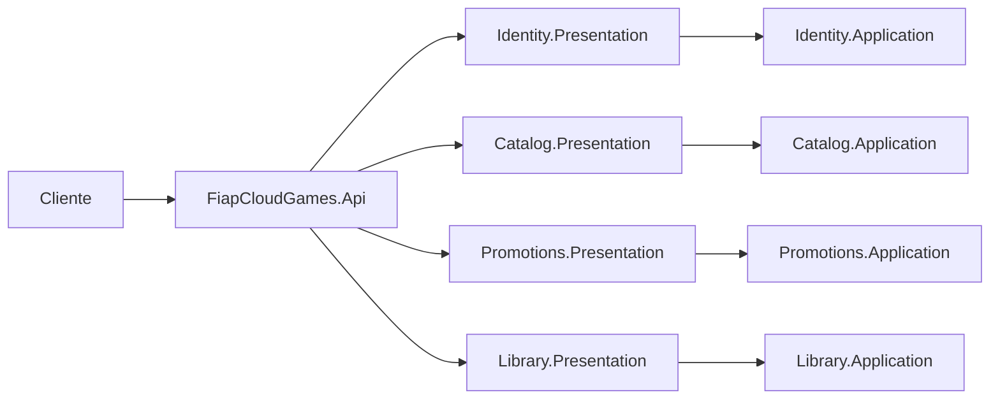
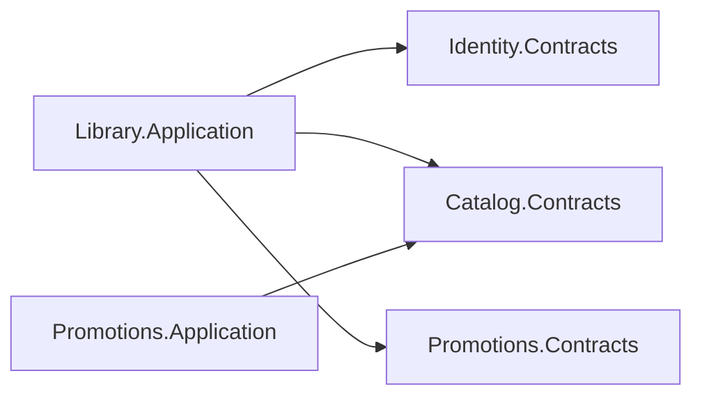
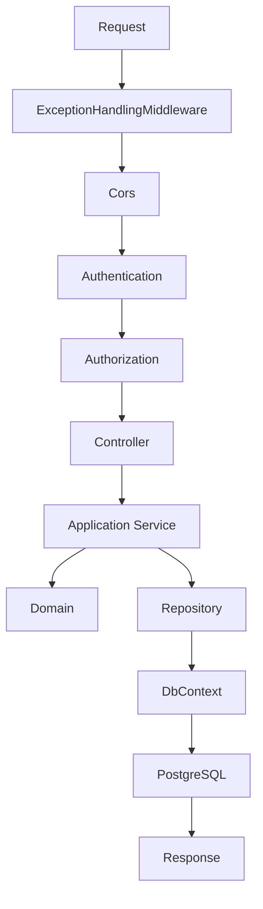
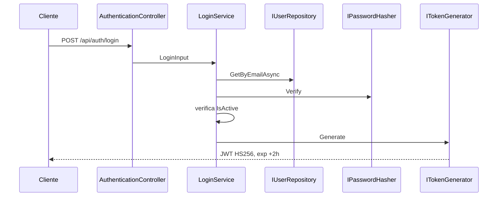
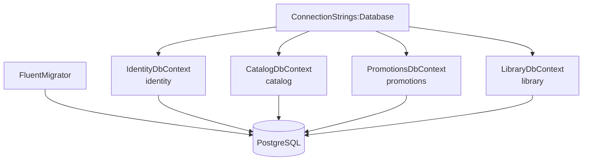
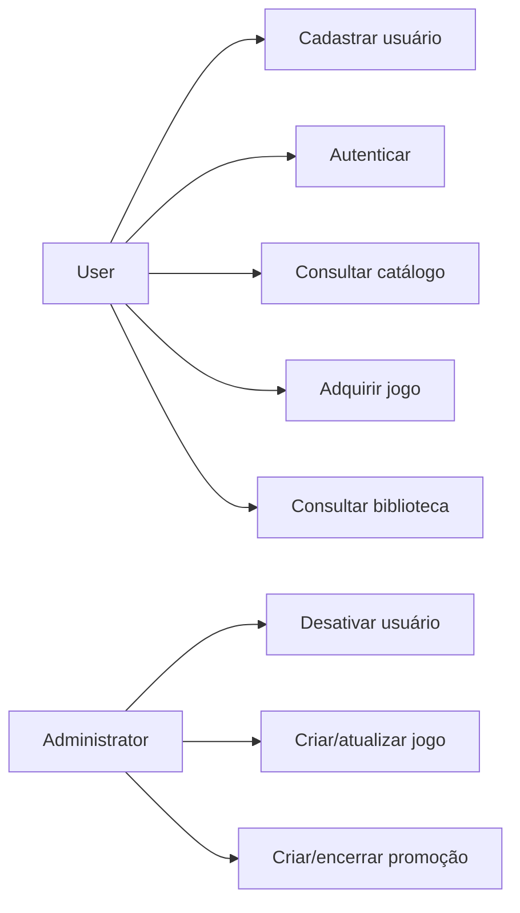
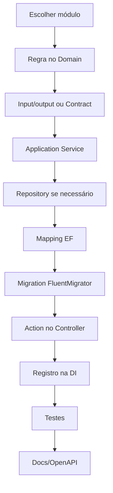

# Diagramas

## Visão geral

## Dependências entre módulos

## Fluxo HTTP

## Autenticação

## Persistência

## Casos de uso

## Criação de endpoint

O arquivo editável de Event Storming está em [EventStorming.drawio](../EventStorming.drawio).
