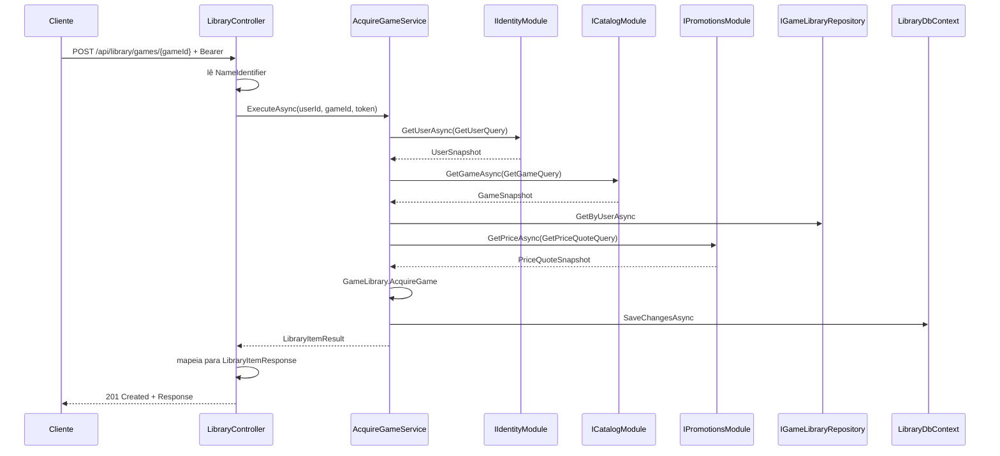

# Fluxo de uma requisição

## Pipeline real

```text
Cliente
→ ExceptionHandlingMiddleware
→ CORS
→ Authentication
→ Authorization
→ OpenAPI, health check ou Controller
→ Application Service
→ Domain ou Contracts
→ Repository
→ DbContext/Npgsql
→ PostgreSQL
→ resposta HTTP
```

O middleware de exceções envolve os componentes registrados depois dele e captura falhas enquanto a resposta não tiver começado.

## Exemplo: adquirir um jogo



| Etapa | Função |
|---|---|
| CORS | adiciona cabeçalhos para origens configuradas |
| Authentication | valida issuer, audience, assinatura e tempo do JWT |
| Authorization | exige autenticação e/ou role |
| Controller | lê rota/body/claims, chama service e define status |
| Application | coordena módulos e persistência |
| Domain | aplica invariantes |
| Repository | carrega e persiste raízes de agregado |
| Query port | executa projeções somente leitura sem tracking |
| Unit of Work | chama `DbContext.SaveChangesAsync` |
| Middleware de exceções | converte exceções conhecidas em Problem Details |

## Respostas fora do mapeamento de exceções

- `NotFound()` retornado diretamente por Controllers;
- challenge 401 e forbid 403 da autenticação/autorização;
- 400 automático de `[ApiController]`;
- resposta de `/health`.

Nem todo erro possui o mesmo corpo. Consulte [Erros da API](../api/errors.md).
