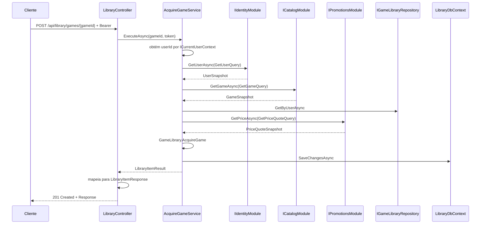

# Fluxo de uma requisição

## Pipeline real

```text
Cliente
→ ClientErrorLoggingMiddleware
→ ExceptionHandlingMiddleware
→ StatusCodePages
→ CORS
→ Authentication
→ Authorization
→ OpenAPI, health check ou Controller
→ Application Service
→ Domain ou Contracts
→ Repository
→ DbContext/Npgsql
→ PostgreSQL
→ resposta HTTP
```

O middleware de logging envolve o tratamento de exceções e registra a resposta
4xx já normalizada. O middleware de exceções captura falhas enquanto a resposta
não tiver começado e preserva a exceção completa somente no log de 500.

`StatusCodePages` completa respostas vazias do framework, como challenge, forbid
e rota inexistente, usando o mesmo contrato Problem Details.

## Exemplo: adquirir um jogo



| Etapa | Função |
|---|---|
| CORS | adiciona cabeçalhos para origens configuradas |
| Authentication | valida issuer, audience, assinatura e tempo do JWT |
| Authorization | exige autenticação e/ou role |
| Controller | lê rota/body, chama service e define status |
| Application | obtém o usuário atual por abstração e coordena módulos e persistência |
| Domain | aplica invariantes |
| Repository | carrega e persiste raízes de agregado |
| Query port | executa projeções somente leitura sem tracking |
| Unit of Work | chama `DbContext.SaveChangesAsync` |
| Middleware de logs 4xx | registra status, tipo, rota, duração e `traceId` sem dados do corpo |
| Middleware de exceções | converte exceções conhecidas em Problem Details |
| StatusCodePages | normaliza respostas vazias produzidas pelo framework |

## Origens das respostas de erro

- exceções funcionais lançadas pelos serviços;
- challenge 401 e forbid 403 da autenticação/autorização;
- 400 automático de `[ApiController]`;
- rota inexistente;
- falhas inesperadas sanitizadas pelo middleware.

Todas essas origens utilizam o mesmo contrato `ApiProblemDetails`. Somente
validações estruturadas acrescentam `errors`. Consulte
[Erros da API](../api/errors.md).
