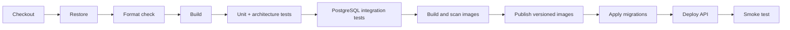

# CI/CD

## Estado atual

Não existem workflows, pipelines ou arquivos de automação de CI/CD no
repositório. Build, testes, migrations e implantação são manuais.

## Validação local equivalente

```powershell
dotnet restore FiapCloudGames.sln --configfile NuGet.Config
dotnet format FiapCloudGames.sln --verify-no-changes --no-restore
dotnet build FiapCloudGames.sln --no-restore
dotnet test FiapCloudGames.sln --no-build --no-restore
docker compose build
```

`docker compose build` exige Docker ativo e acesso às imagens/feeds necessários.

## Pipeline recomendado

Esta sequência é uma proposta, não uma implementação:



## Controles necessários

- SDK .NET fixado e cache de NuGet;
- execução em pull request e branch protegida;
- credenciais em secret store, nunca em YAML versionado;
- execução dos testes transversais sem dependências externas;
- análise de dependências/imagens;
- artefatos e imagens imutáveis;
- aprovação para migrations e produção;
- smoke test e rollback testado.

`TODO: escolher a plataforma de CI/CD, política de branches, registry, ambientes e
responsáveis por aprovação.`

