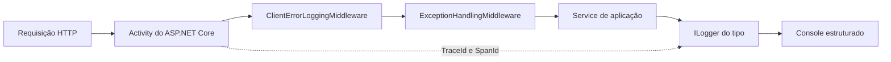

# Logging estruturado e monitoramento

## Objetivo

A aplicação usa `ILogger<T>`, a abstração padrão do .NET, para produzir logs
estruturados e consistentes nos módulos `Identity`, `Catalog`, `Library` e
`Promotions`.

Esta implementação permite:

- acompanhar o início e a conclusão das operações relevantes;
- investigar falhas de negócio e exceções inesperadas;
- pesquisar eventos por propriedades como `UserId`, `GameId` e `PromotionId`;
- correlacionar logs da mesma requisição por `TraceId` e `SpanId`;
- configurar a verbosidade por ambiente;
- manter os logs legíveis no console durante o desenvolvimento.

O escopo atual é exclusivamente logging. Métricas, criação manual de traces,
exportadores e plataformas externas continuam fora do escopo.

## Visão geral da implementação



O ASP.NET Core cria uma `Activity` para a requisição HTTP. A configuração do
logging lê essa atividade e adiciona seus identificadores ao escopo dos logs.
Os serviços não criam traces manualmente e permanecem desacoplados de qualquer
plataforma de observabilidade.

## Configuração da API

O arquivo
[`Program.cs`](../../src/Api/FiapCloudGames.Api/Program.cs) configura o logging
antes do registro dos serviços:

```csharp
builder.Logging.Configure(options =>
    options.ActivityTrackingOptions =
        ActivityTrackingOptions.TraceId |
        ActivityTrackingOptions.SpanId);

builder.Logging.AddSimpleConsole(options =>
{
    options.IncludeScopes = true;
    options.SingleLine = true;
    options.TimestampFormat = "yyyy-MM-dd HH:mm:ss.fff zzz ";
});
```

Essa configuração possui três efeitos:

1. `TraceId` identifica todos os eventos pertencentes ao fluxo da requisição;
2. `SpanId` identifica a atividade atual dentro desse fluxo;
3. o console exibe timestamp, escopos e cada evento em uma única linha.

Os identificadores são adicionados somente quando existe uma `Activity` ativa.
Isso ocorre normalmente durante requisições HTTP. Uma execução fora desse
contexto continua gerando logs, porém sem correlação HTTP.

## Logging estruturado

Os valores variáveis são passados separadamente da mensagem:

```csharp
logger.LogInformation(
    "Iniciando aquisição do jogo {GameId} para o usuário {UserId}.",
    gameId,
    userId);
```

`GameId` e `UserId` tornam-se propriedades do evento, além de aparecerem na
mensagem renderizada.

Não deve ser usada interpolação em chamadas de log:

```csharp
// Não usar: os valores deixam de ser propriedades estruturadas.
logger.LogInformation(
    $"Iniciando aquisição do jogo {gameId} para o usuário {userId}.");
```

### Convenção dos nomes das propriedades

As propriedades usam `PascalCase` e nomes relacionados ao domínio:

| Propriedade | Conteúdo |
| --- | --- |
| `UserId` | identificador do usuário |
| `GameId` | identificador do jogo |
| `PromotionId` | identificador da promoção |
| `LibraryItemId` | identificador do item adquirido |
| `GameCount` | quantidade de jogos |
| `PromotionCount` | quantidade de promoções |
| `OnlyActive` | filtro aplicado à listagem |
| `IsActive` | estado ativo do recurso |
| `Method` | método HTTP |
| `Path` | caminho da requisição, sem query string |
| `Status` | status HTTP produzido |
| `Type` | tipo estável do Problem Details |
| `DurationMs` | duração da requisição em milissegundos |
| `ValidationFields` | nomes dos campos inválidos, sem seus valores |
| `ValidationErrorCount` | quantidade de erros de validação |

## Níveis de log adotados

| Nível | Uso nesta implementação |
| --- | --- |
| `Debug` | consultas, listagens, bibliotecas vazias, ausência esperada de promoção, chamadas entre módulos e cancelamento pelo cliente |
| `Information` | operações concluídas e respostas esperadas 400, 401, 404, 409 e 422 |
| `Warning` | respostas 403 e 429, recurso necessário não encontrado e rejeições relevantes para segurança |
| `Error` | exceção inesperada que impede o processamento da requisição |

`Trace` e `Critical` continuam disponíveis, mas nenhum fluxo atual possui um
evento que justifique esses níveis.


## Integrações entre módulos

As integrações são registradas no serviço que inicia a chamada. Por exemplo, a
aquisição de um jogo registra quando consulta os módulos `Identity`, `Catalog` e
`Promotions`. A criação de promoção registra a validação feita no `Catalog`.

Essa abordagem preserva o contexto da operação principal e permite acompanhar
o fluxo usando os mesmos `TraceId` e `SpanId` da requisição.

## Respostas HTTP 4xx

O
[`ClientErrorLoggingMiddleware.cs`](../../src/Api/FiapCloudGames.Api/Middlewares/ClientErrorLoggingMiddleware.cs)
envolve o tratamento de exceções e registra toda resposta 4xx depois que seu
`ApiProblemDetails` foi produzido. Isso inclui:

- validações automáticas de `[ApiController]` e JSON malformado;
- challenge 401 e forbid 403;
- rota ou recurso inexistente;
- `AppException` e `DomainRuleViolationException` convertidas pela API.

Cada resposta gera um único evento HTTP estruturado. Respostas 400, 401, 404,
409 e 422 usam `Information`; 403 e 429 usam `Warning`. A mensagem contém
`Type`, `Status`, `Method`, `Path` e `DurationMs`; o `TraceId` W3C de 32
caracteres já é fornecido pelo scope do `ILogger` e não é repetido no texto. Em
validações, registra somente a quantidade e os nomes dos campos, nunca mensagens
ou valores.

## Tratamento global de exceções

O
[`ExceptionHandlingMiddleware.cs`](../../src/Api/FiapCloudGames.Api/Middlewares/ExceptionHandlingMiddleware.cs)
possui três comportamentos:

### Requisição cancelada pelo cliente

O cancelamento é registrado em `Debug` com `Method` e `Path`. Ele não é tratado
como erro da aplicação.

### Falha conhecida

Exceções de domínio e `AppException` são convertidas em Problem Details. O
registro HTTP correspondente é feito pelo `ClientErrorLoggingMiddleware`, sem
stack trace ou mensagem funcional, evitando duplicidade e exposição de dados.

### Exceção inesperada

Falhas que resultam em status `500` usam a sobrecarga de `LogError` que recebe a
exceção original:

```csharp
logger.LogError(
    exception,
    "Erro não tratado ao processar {Method} {Path}.",
    context.Request.Method,
    context.Request.Path);
```

Assim, o evento contém tipo da exceção, mensagem e stack trace. A resposta HTTP
continua expondo apenas o Problem Details genérico, sem detalhes internos.

## Dados sensíveis

Não devem ser registrados:

- senha ou hash da senha;
- e-mail ou outros dados pessoais sem necessidade operacional;
- JWT completo ou header `Authorization`;
- `Jwt:Key`;
- connection string;
- secret ou API key;
- corpo de requisições de autenticação.
- mensagens e valores rejeitados durante validação.

Falhas de autenticação usam uma mensagem genérica e não informam se o e-mail
existe. Isso evita exposição de dados e enumeração de usuários.

O nível `Information` dos comandos do Entity Framework Core em Development pode
revelar detalhes de consultas. Ele deve ser usado somente em ambiente
controlado.

## Validação automatizada

Os testes
[`LoggingConfigurationTests.cs`](../../tests/Integration/FiapCloudGames.Api.IntegrationTests/Host/LoggingConfigurationTests.cs)
resolve `LoggerFactoryOptions` da aplicação e confirma que as opções
`ActivityTrackingOptions.TraceId` e `ActivityTrackingOptions.SpanId` estão
ativas. Já
[`ClientErrorLoggingMiddlewareTests.cs`](../../tests/Integration/FiapCloudGames.Api.IntegrationTests/Components/ClientErrorLoggingMiddlewareTests.cs)
verifica os níveis por status, os campos estruturados e a ausência de mensagens
de validação nos logs.

Comandos usados para validar a implementação:

```powershell
dotnet build FiapCloudGames.sln
dotnet test FiapCloudGames.sln --no-build --no-restore
```

## Operação local

Acompanhe o terminal que executa a API ou o migrador. No console, os campos
estruturados aparecem renderizados na mensagem. Os escopos também incluem
`TraceId` e `SpanId` quando a origem é uma requisição HTTP.
